# NetGuard — System Design & Diagrams

> [!NOTE]
> All diagrams below are rendered using Mermaid. For your report, **redraw these as polished figures** using tools like draw.io, Lucidchart, or Visio, then insert them as images at 300 DPI.

---

## 1. System Architecture Diagram

This is the top-level view of how NetGuard's components connect.

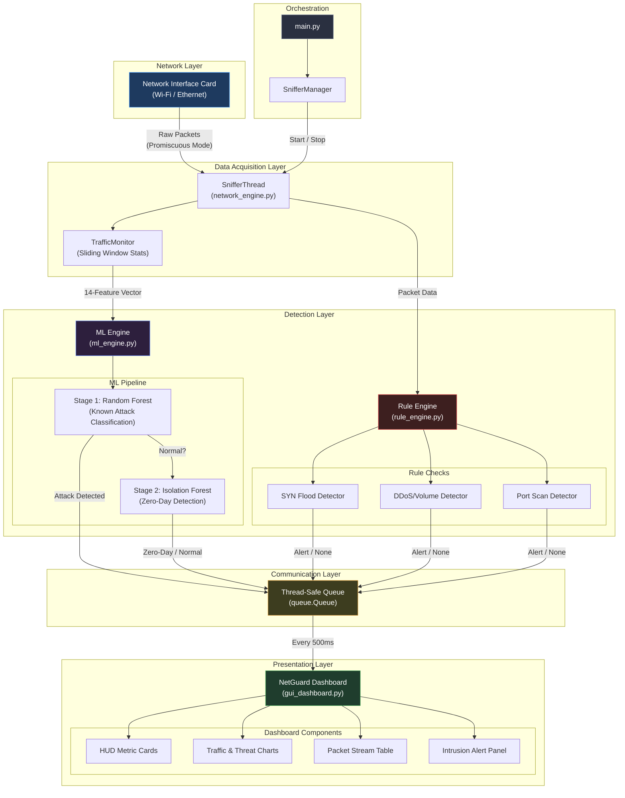

---

## 2. Data Flow Diagram (DFD) — Level 0

The context-level DFD showing NetGuard as a single process.

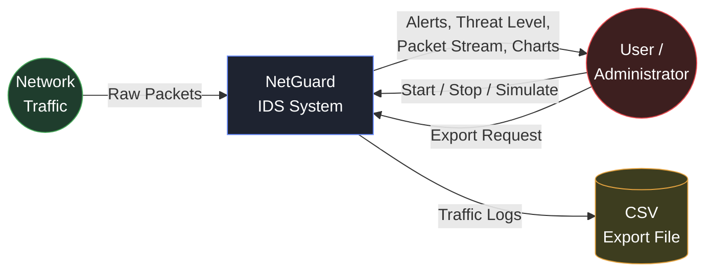

---

## 3. Data Flow Diagram (DFD) — Level 1

Breaks NetGuard into its internal processes.

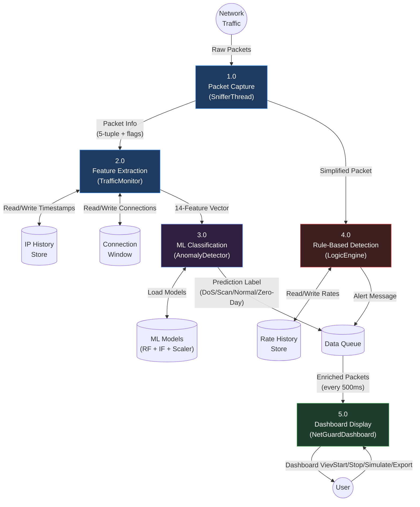

---

## 4. Use Case Diagram

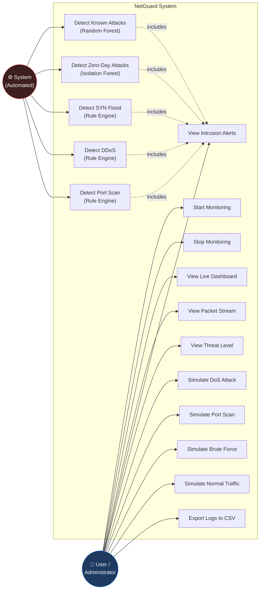

---

## 5. Sequence Diagram — Packet Processing Pipeline

Shows the exact order of operations when a single packet arrives.

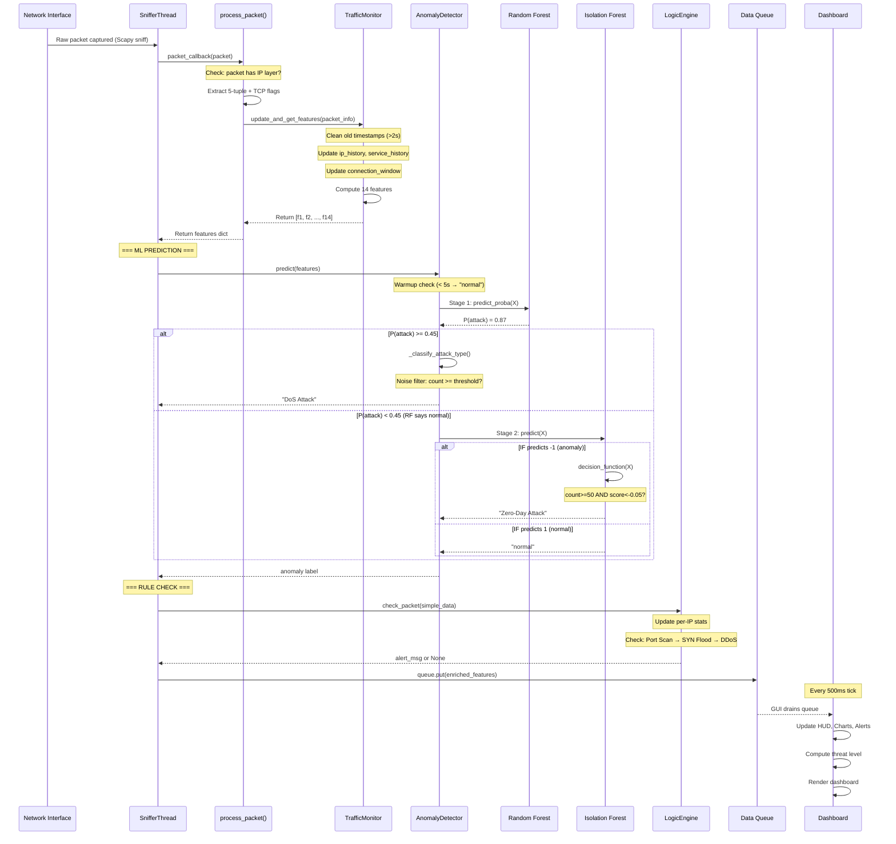

---

## 6. Class Diagram

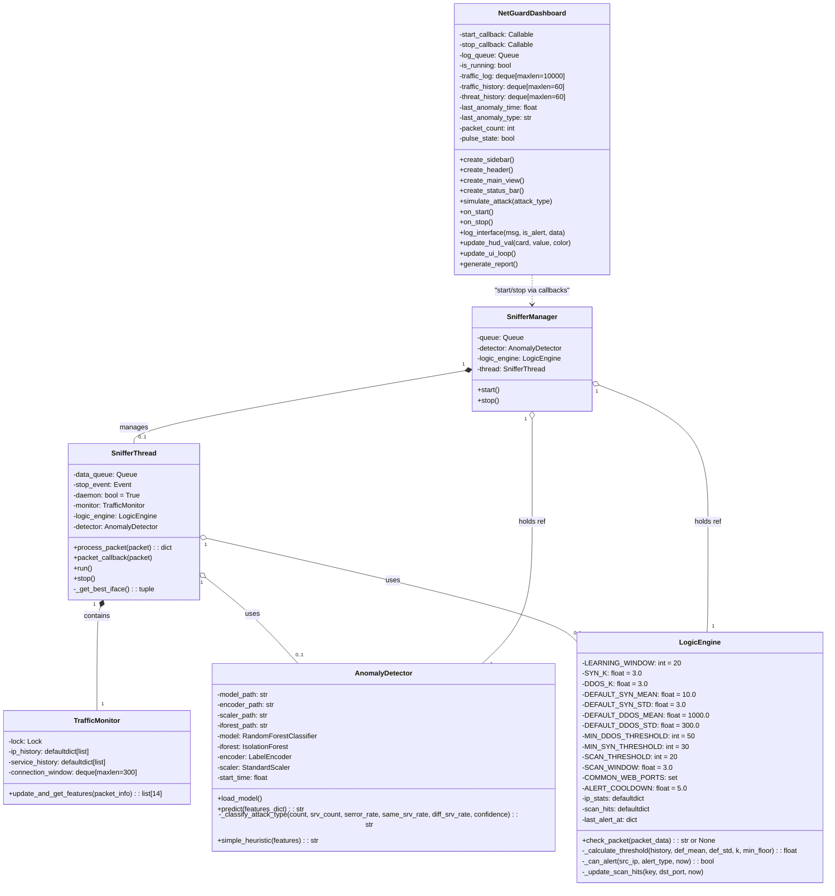

---

## 7. Activity Diagram — Threat Detection Flow

Shows the complete decision logic for a single packet.

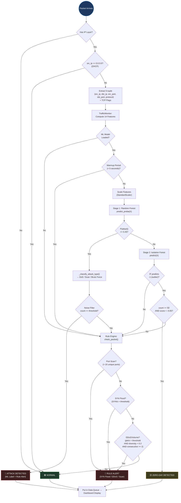

---

## 8. State Diagram — Dashboard Threat Level

Shows how the dashboard transitions between threat states.

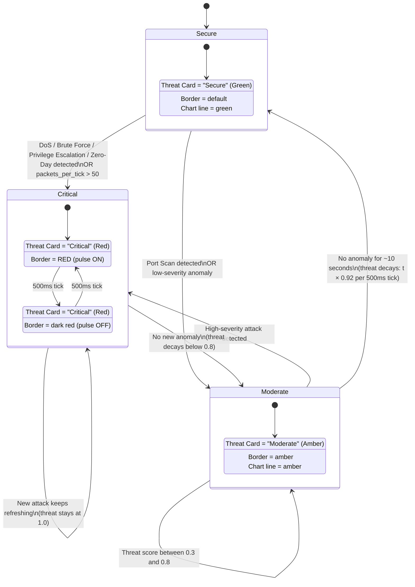

**Threat Level Thresholds:**
| State | Threat Score Range | Trigger |
|---|---|---|
| Secure | 0.0 – 0.29 | No anomaly or decayed below 0.3 |
| Moderate | 0.3 – 0.79 | Low-severity anomaly (e.g., Port Scan) |
| Critical | 0.8 – 1.0 | High-severity attack (DoS, DDoS, Zero-Day) |

**Decay Formula:** `threat(t) = threat(t-1) × 0.92` (when no active anomaly)
- Critical → Moderate: ~2.5 seconds
- Critical → Secure: ~10 seconds

---

## 9. Component Diagram

Shows physical module dependencies and communication.

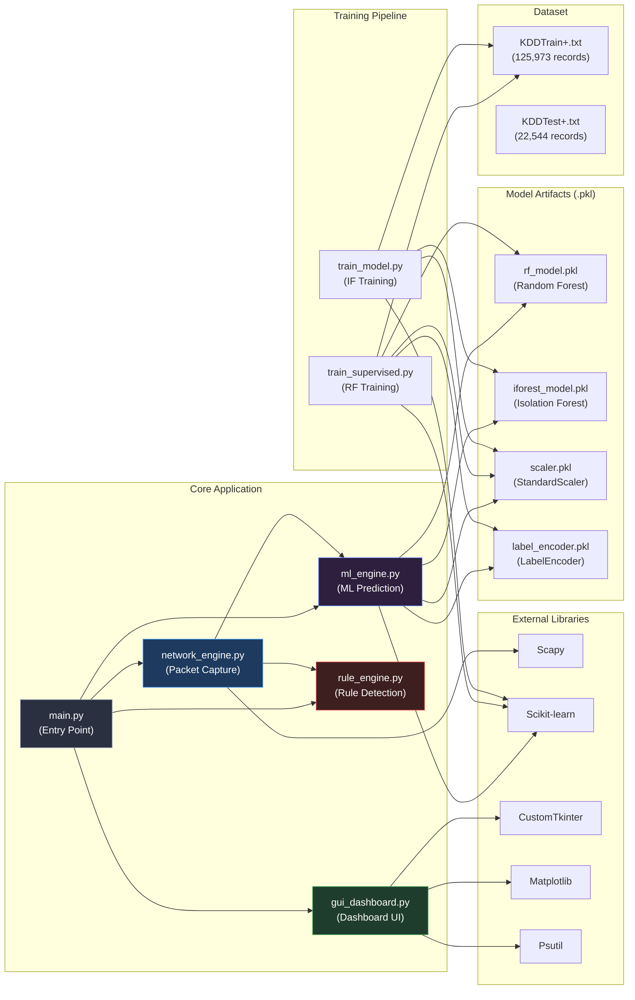

---

## 10. ML Pipeline Detail — Two-Stage Cascaded Architecture

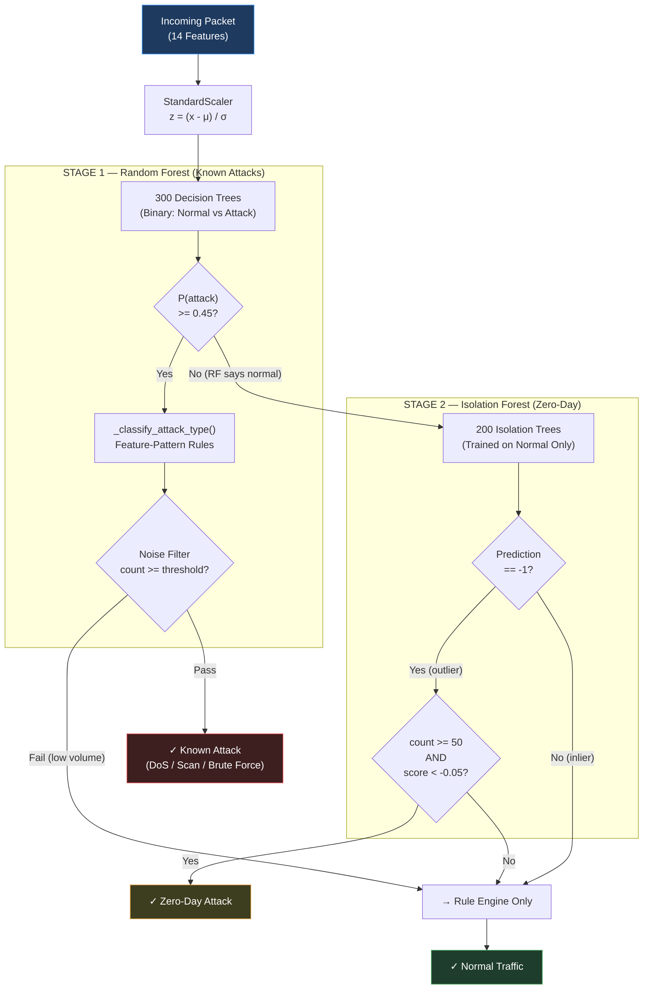

**Attack Classification Rules (Priority Order):**

| Priority | Condition | Classification |
|---|---|---|
| 1 | serror_rate > 0.5 AND count > 50 | DoS Attack |
| 2 | diff_srv_rate > 0.5 AND count > 10 | Port Scan |
| 3 | count > 15 AND srv_count < count × 0.2 | Port Scan |
| 4 | same_srv_rate > 0.8 AND serror_rate < 0.3 AND count < 300 | Brute Force/Malware |
| 5 | count > 300 AND same_srv_rate > 0.8 | DoS Attack |
| 6 | confidence > 0.85 AND count > 100 | DoS Attack |
| 7 | confidence > 0.5 AND count > 10 | Brute Force/Malware |
| 8 | Default catch-all | DoS Attack |

---

## 11. Rule Engine — Dynamic Threshold Detection Logic

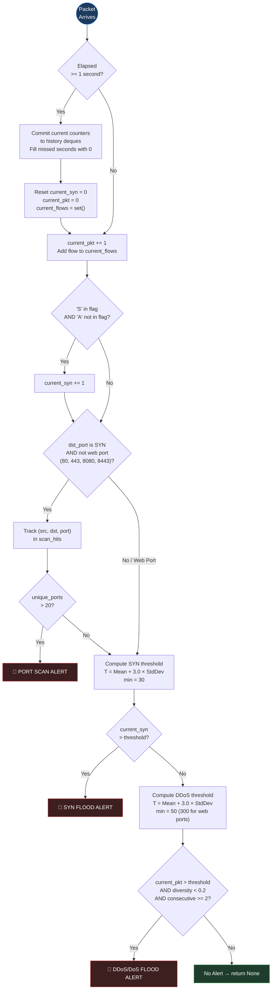

**Threshold Equation:**
```
     ┌─────────────────────────────────────────────────────┐
     │  Threshold = Mean(history) + K × StdDev(history)    │
     │                                                     │
     │  Where:                                             │
     │    K = 3.0 (3-sigma → 99.7% confidence)             │
     │    history = last 20 seconds of per-IP rates         │
     │    If history < 2 samples → use defaults             │
     │    Result is clamped to: max(computed, safety_floor) │
     └─────────────────────────────────────────────────────┘
```

---

## 12. ER Diagram — In-Memory Data Structures

NetGuard uses no traditional database but maintains structured in-memory stores.

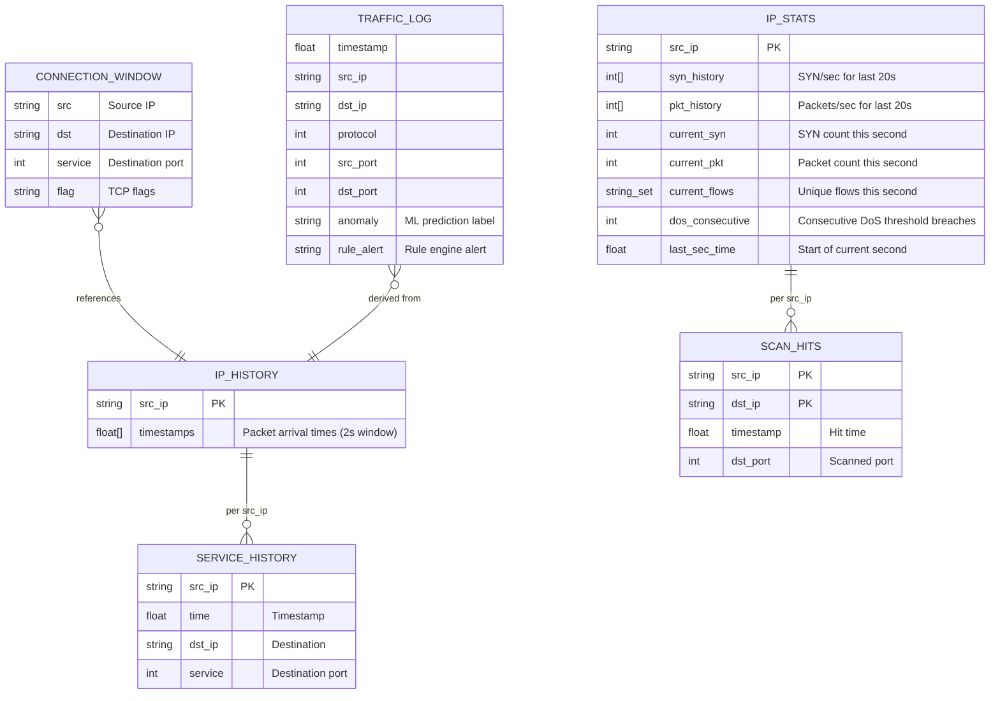

---

## Summary — Diagrams for Report

| Figure # | Diagram Type | Where to Use in Report |
|---|---|---|
| Fig 4.1 | System Architecture | Chapter IV (Section 4.1) |
| Fig 4.2 | DFD Level 0 | Chapter IV (Section 4.2) |
| Fig 4.3 | DFD Level 1 | Chapter IV (Section 4.2) |
| Fig 4.4 | Use Case Diagram | Chapter IV (Section 4.3) |
| Fig 4.5 | Sequence Diagram | Chapter IV (Section 4.3) |
| Fig 4.6 | Class Diagram | Chapter IV (Section 4.3) |
| Fig 4.7 | Activity Diagram | Chapter IV (Section 4.3) |
| Fig 4.8 | State Diagram (Threat Levels) | Chapter IV (Section 4.4) |
| Fig 4.9 | Component Diagram | Chapter IV (Section 4.2) |
| Fig 5.1 | ML Pipeline Detail | Chapter V (Section 5.3) |
| Fig 5.2 | Rule Engine Logic Flow | Chapter V (Section 5.4) |
| Fig 4.10 | ER Diagram (Data Structures) | Chapter IV (Section 4.4) |

> [!TIP]
> For your report, redraw these diagrams using **draw.io** (free, exports to high-res PNG). The Mermaid versions here are for reference and accuracy — the visual layout in draw.io will be cleaner for print.
